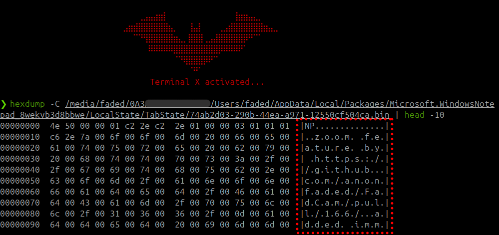

<div align="center">

  # `>_` NotepadDecoder
  
  
  *Recover and decode unsaved Windows Notepad binary files into readable notes.*
</div>

## `>_` Detailed Guide

For a comprehensive step-by-step guide including manual analysis with `strings` and `hexdump`, visit:  
**[Complete Guide: Decoding Notepad Binary Files](https://blog.faded.dev/posts/notepad_decoder/)**

## `>_` Overview

NotepadDecoder extracts UTF-16LE encoded text from Windows Notepad's TabState binary files. These files contain unsaved Notepad content that would otherwise be lost. Perfect for dual-boot setups, forensics, or data recovery scenarios.

## `>_` Features

- 🔍 **Automatic Detection**: Scans for UTF-16LE text runs in .bin files
- 📁 **Batch Processing**: Process single files or entire directories
- 🎨 **Interactive Mode**: User-friendly CLI with file previews
- 💾 **Smart Output**: Saves decoded content as readable markdown files
- 🖥️ **Cross-Platform**: Works on Linux, Windows, and macOS

## `>_` Quick Start

### `>_` Prerequisites
- Python 3.10+ ([Download Python](https://www.python.org/downloads/))
- For colors: `pip install colorama`

### `>_` Installation
```bash
git clone https://github.com/anonfaded/NotepadDecoder.git
cd NotepadDecoder
```

### `>_` Usage

**Single File:**
```bash
python3 notepad_decoder.py /path/to/TabState/file.bin
# or python notepad_decoder.py on Windows
```

**Directory (Batch Processing):**
```bash
python3 notepad_decoder.py /path/to/TabState/
# or python notepad_decoder.py on Windows
```

**Interactive Mode:**
```bash
python3 notepad_decoder.py
# or python notepad_decoder.py on Windows
```

**Help:**
```bash
python3 notepad_decoder.py --help
# or python notepad_decoder.py --help on Windows
```

## `>_` Example Output
When run on a single `.bin` file, this is the output:

```md
Extracted Content:
----------------------------------------
added zoom feature
added immediate delete option
some notes here
fixed issue with the wide lens and 60fps not working
```

## `>_` Windows TabState Location

The TabState files are located at:
```zsh
C:\Users\USERNAME\AppData\Local\Packages\Microsoft.WindowsNotepad_8wekyb3d8bbwe\LocalState\TabState\
```

For dual-boot Linux users, use `ls -la /media/<USER>/` to find the mounted drives and navigate to where the TabState files are stored:
```zsh
/media/USERNAME/DRIVE/Users/USERNAME/AppData/Local/Packages/Microsoft.WindowsNotepad_8wekyb3d8bbwe/LocalState/TabState/
```

## `>_` How It Works

1. **UTF-16LE Detection**: Scans binary files for UTF-16LE encoded ASCII sequences
2. **Fallback Decoding**: Attempts whole-file UTF-16LE decoding at multiple offsets
3. **Content Extraction**: Extracts readable text and saves as markdown files
4. **Smart Naming**: Creates meaningful filenames from content

## `>_` License

MIT License - see LICENSE file for details.

